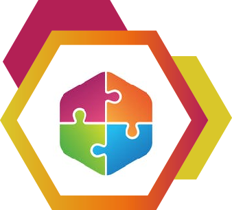

  
  <h1>Puzzle Pattern</h1>

  Puzzle Pattern is a VueJS development pattern created for code organization, using the best practices, clean code, and much more.

## Why use the Puzzle Pattern?

...

## MUST

* Use ES6 in full capacity;
* Set a default language to be used throughout the project. If it's not your native language, define all the words will not be translated;
* Define a code order inside your `<script>` that must be followed throughout all components. Only declare it if you are going to use it in your component. The recommended order is:  
      1. imports
      2. export default {
        2.1. name: ''
        2.2. props: {}
        2.3. components: {}
        2.4. mixins: []
        2.5. directives: {}
        2.6. data: () => ({})
        2.7. computed: {}
        2.8. filters: {}
        2.9. beforeCreate () {}
        2.10. created () {}
        2.11. beforeMount () {}
        2.12. mounted () {}
        2.13. beforeUpdate () {}
        2.14. updated () {}
        2.15. beforeDestroy () {}
        2.16. destroyed () {}
        2.17. methods: {}
        2.18. watch: {}
      }

* Props must always be an object with a declared type;
* Props should be declared with lower `camelCase`. However, in the HTML they must be called with `kebab-case`;
* Pass a parameter method only when needed;
* Prioritize the use of `const`, otherwise use `let`;
* The `data ()` declaration must be like this: `data: () => ({});`
* If you wish to use the queryString when sending a GET request, use the `{ params }` object;
* The `export default` must be at the same level of indentation as the `<script>`. The same goes for the first CSS property inside the `<style>`;
* Remove all unused declarations, `vars` and empty tags. The same goes for the `<script>` and `<style>`;
* One line break after all the `imports`;
* One space always before and after a variable inside an interpolation;
* Double quotes in all HTML tag attributes;
* When a tag has more than one attribute, put on a line break;
* Put a line break after each dot inside your script whenever possible;
* When calling a method inside your HTML component, always put the parentheses "()";
* Only use `mapGetters` when you are manipulating the `state`;
* Moderate use of [vuex](https://github.com/vuejs/vuex), only in cases when you need the same state in a few components;
* Using [vuex](https://github.com/vuejs/vuex), always use `mapGetters`, `mapState`, `mapActions` and `mapMutations`, instead of `this.$store`;
* A [vuex's](https://github.com/vuejs/vuex) action should always return a promise.

## SHOULD

* Use `computed properties` in your HTML instead of methods;
* Use `filter`, `map`, `reduce` and `find`;
* Create customized events rather than props with type Function which returns a callback;
* Use the `created ()` _Lifecycle_ rather than `mounted ()`;
* Use `v-if` instead of `v-show`;
* Use the `.sync` modifier rather than `v-model`;
* Use display flex rather than other types of display;
* Import your files with "@" rather than "../";
* Whenever you are going to duplicate a code, create a mixin instead and declare it locally.

## AVOID

* Using watchs, use computed instead;
* Using `var`, use `const` or `let` instead;
* Using `else`, prioritize early return;
* Using `switch case`;
* Using `forEach`, `for in`, `for` and `while`;
* Using the attribute `style` static in your HTML tags;
* Using `scoped` on your `<style>`, instead create a CSS class and wrap all your `<template>` on it, then put all other class you have inside that one;
* Using the `beforeUpdate ()` and `updated ()` _Lifecycle_;
* Using the directive `v-html`;
* Using more than one props type;
* Declaring global filters;
* Declaring global directives;
* Declaring global components with `Vue.component()`;
* Treating Date as a String, use [momentjs](https://momentjs.com/) instead;
* Having several levels of indentation;
* In a request, avoid grabbing all of the `response`. Instead, grab only what you are going to actually use.

## DON'T

...

### Code Style Recommended

This is the code style that was used to create this pattern and it's recommended to use it's full potential.

### TODO

* [ ] Write the "Why use the Puzzle Pattern?" section.
* [x] Write the "Should" section.
* [x] Write the "Avoid" section.
* [ ] Write the "Don't" section.
* [ ] Develop a Puzzle ESLint.
* [ ] Develop a Puzzle Editor Plugin.

## License

MIT © [guastallaigor](https://github.com/guastallaigor/puzzle-pattern)
